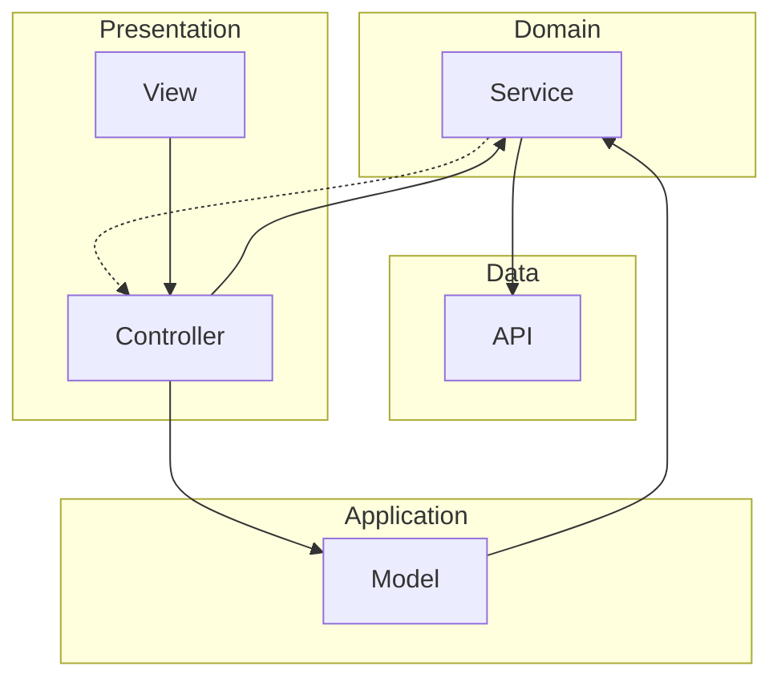

# ARCHITECTURE

## 依存関係



## ファイル構成

```tree
lib
├── main.dart
├── app.dart
├── component
│   └── *.dart
├── domain
│   └── *_service.dart
├── gen
│   └── assets.gen.dart
├── model
│   ├── *_error.dart
│   └── *_model.dart
├── provider
│   └── *_provider.dart
├── util
│   └── *.dart
└── view
    └── *.dart
```


### `component`
`view` のための再利用可能なUI要素を定義する。

### `domain`
`Service` を定義する。

### `gen`
自動生成されたファイル群。

### `model`
`Model` を定義する。
データのシリアライズやデシリアライズを担う。

### `provider`
`view` のためのコントローラーを定義する。
`Service` をユースケースまで抽象化する。
依存性注入が可能。

### `util`
アプリ全体で使用するユーティリティを定義する。

### `view`
アプリのUIやレイアウトを定義する。