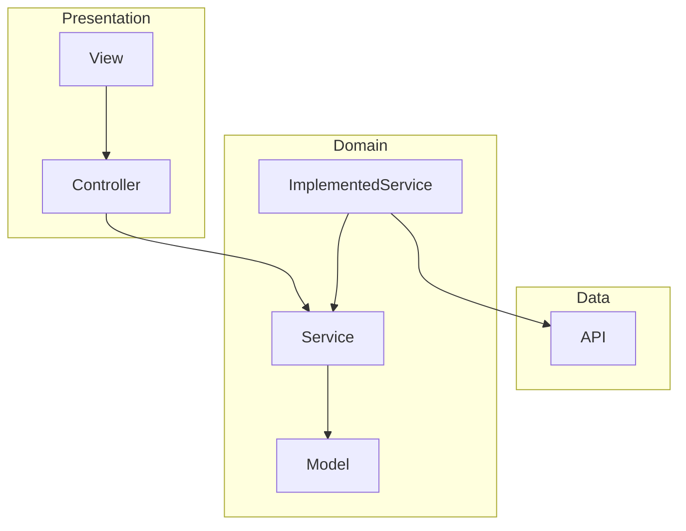

# ARCHITECTURE

## 依存関係

`Domain` をコアとした、アーキテクチャを作成。



`Dart` には `Implicit interfaces` があるため `Service` と `ImplementedService` を一つのクラスで記述している

## ファイル構成

```tree
lib
├── main.dart
├── app.dart
├── component
│   └── *.dart
├── service
│   └── *_service.dart
├── gen
│   └── assets.gen.dart
├── model
│   ├── *_error.dart
│   └── *_model.dart
├── controller
│   └── *_controller.dart
├── util
│   └── *.dart
└── view
    └── *.dart
```

### `component`

`view` のための再利用可能な UI 要素を定義する。

### `service`

`Service` を定義する。
`Data` から取得した情報を抽象化する。

天気データを取得して、アプリの天気モデルにする。

### `gen`

自動生成されたファイル群。

### `model`

`Model` を定義する。
データのシリアライズやデシリアライズを担う。

### `controller`

`view` のためのコントローラーを定義する。

アプリの天気モデルを `view` に渡す。

### `util`

アプリ全体で使用するユーティリティを定義する。

### `view`

アプリの UI やレイアウトを定義する。
